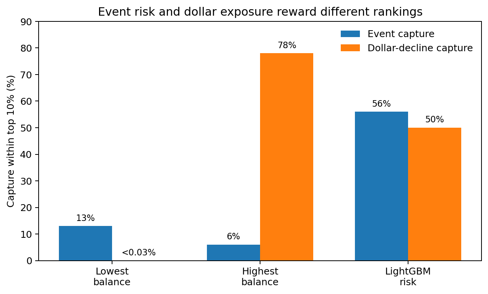
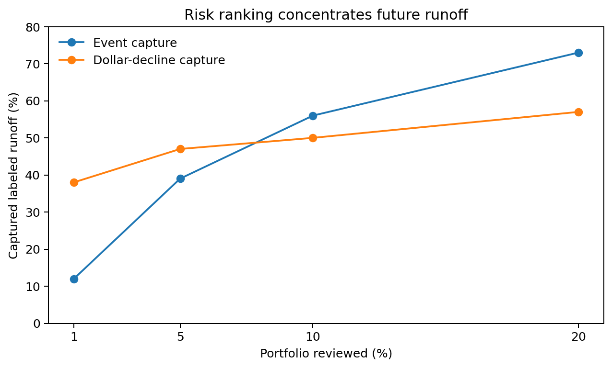

# Deposit Runoff Early-Warning: From Predictive Performance to Model Validity

A temporal LightGBM model reached **~0.85 ROC-AUC** and **~0.47 PR-AUC** versus a **~0.07 prevalence baseline** on an unseen month. The more important finding came after the model was challenged: recent deterioration drove much of the signal, and **event-risk prediction and dollar-exposure prioritization were different business objectives**.

## Problem

The project asks whether historical deposit behavior can rank accounts by risk of a significant future balance decline. The intended output is a **prioritized review queue**, not an automatic pricing or retention action.

That business question eventually split into two:

1. **Event risk:** Which accounts are most likely to experience significant runoff?
2. **Dollar exposure:** Which accounts matter most if runoff occurs?

## Data

The original analysis used a confidential, multi-year daily deposit-account panel from a U.S. financial institution.

- Raw unit: account × calendar day
- Modeling unit: account × month-end snapshot
- Scale: large daily panel with hundreds of thousands of active accounts per scoring date
- Population: active, positive-balance checking and savings accounts
- Public repo: institution names, internal database objects, product names, identifiers, exact portfolio sizes, and absolute dollar amounts are removed or generalized

Raw institutional data are **not** included. `data/README.md` documents the generic schema, and the repo includes a deterministic synthetic dataset generator for code-path reproduction.

## Approach

**1. Baselines first.** A prevalence baseline set the PR-AUC floor, and a recent-deterioration heuristic tested whether machine learning added value beyond an obvious behavioral signal.

**2. Point-in-time features.** Features used only information available at or before each snapshot: balance level, recent trend, volatility/range, tenure, product category, and deposit rate.

**3. Temporal validation.** Earlier monthly snapshots were used for training, the next month for validation, and a later unseen month for final testing. This matches the direction of a real scoring workflow better than a random split.

**4. Model audit.** SHAP and failure analysis showed that recent balance deterioration was the strongest predictor, raising a harder question: *was the model forecasting runoff, or partly recognizing deterioration already underway?*

**5. Objective audit.** Event frequency and funding exposure were compared separately rather than assuming that a single risk score optimized both.

## Results

| Evaluation | Model / baseline | ROC-AUC | PR-AUC |
|---|---|---:|---:|
| Validation month | Recent-deterioration heuristic | ~0.74 | ~0.29 |
| Validation month | LightGBM | **~0.86** | **~0.46** |
| Unseen holdout | Prevalence baseline | - | ~0.07 |
| Unseen holdout | **LightGBM** | **~0.85** | **~0.47** |

On the unseen holdout, the highest-risk 10% captured **~56% of labeled runoff events** and **~50% of labeled balance decline**.

The objective audit was more revealing:

| Top 10% ranked by | Event capture | Dollar-decline capture |
|---|---:|---:|
| Lowest balances | ~13% | **<0.03%** |
| Highest balances | ~6% | **~78%** |
| LightGBM risk | **~56%** | ~50% |



**Interpretation:** behavioral ML added clear value for identifying runoff events, while simple large-balance ranking was stronger for concentrating dollar exposure. The practical recommendation is therefore **behavioral risk scoring + separate large-balance exposure monitoring**.



## From performance to model validity

The initial result was deliberately stress-tested rather than treated as final. A stricter robustness analysis removed accounts with obvious deterioration at the scoring date; performance declined materially, indicating that some headline performance came from already-visible deterioration.

The final stage redesigned the experiment into distinct windows:

`reference → observation → lead period → outcome`

The redesigned robustness dataset separated the reference baseline from the observation window, screened already-deteriorated relationships, compared transient versus sustained lead-period deterioration, and applied a materiality rule. It was constructed across multiple monthly snapshots as a **model-validity experiment**, not presented as a replacement production model.

## Limitations & next steps

- The 50% decline target is an analytical definition, not an enterprise runoff standard.
- Balance history does not capture richer transaction signals such as payroll, ACH, recurring inflows, and transfer behavior.
- The model is account-level rather than full customer-relationship level.
- The analysis is predictive, not causal; it does not estimate intervention effectiveness or realized savings.
- Abrupt large-balance runoff can occur with little warning in balance-history features.
- The redesigned robustness cohort conditions on future lead-window behavior, so it measures **conditional farther-horizon signal**, not a deployable population-selection rule available at scoring time.

Natural next steps are transaction/cash-flow features, relationship-level aggregation, separate probability and severity models, and model training directly on the redesigned target.

## Reproduce

The original institutional results cannot be regenerated publicly because the underlying data are confidential. The public repo reproduces the **transformation, target, validation, modeling, audit, and redesign code paths** with deterministic synthetic data.

```bash
 git clone https://github.com/lisawkchung/deposit-runoff-early-warning
 cd deposit-runoff-early-warning
 python -m venv .venv
 source .venv/bin/activate
 pip install -e ".[dev]"

 python scripts/make_demo_data.py --config config/public.yaml
 pytest -q
 python scripts/run_public_demo.py --config config/public.yaml
```

For an authorized schema-compatible dataset:

```bash
python scripts/run_analysis.py --config config/example.yaml
```

See `data/README.md` for the expected input schema.
